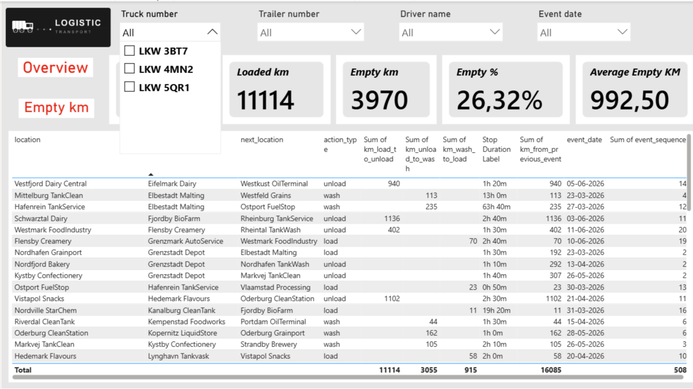
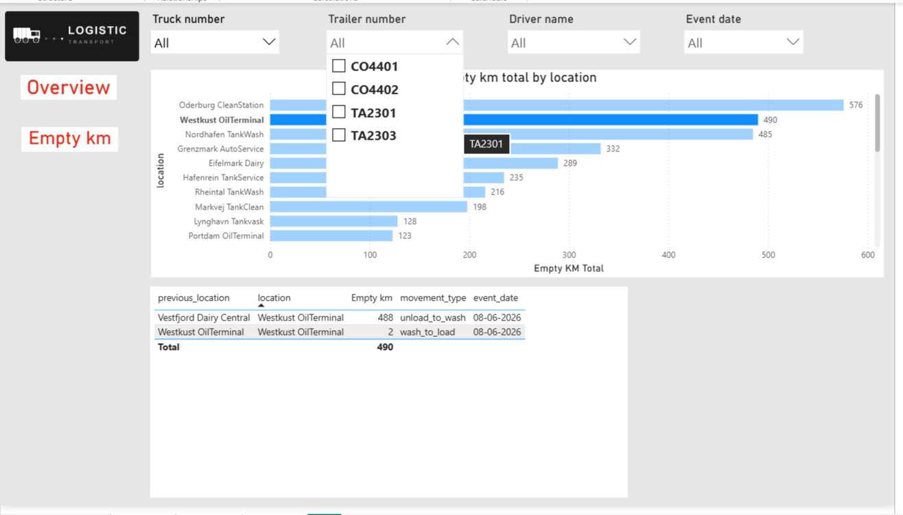

# Logistics Transport — Data Analytics Project

A end-to-end data project for a logistics company tracking truck trips, trailer usage, driver assignments, and route efficiency across Europe.

Built with **PostgreSQL** and visualized in **Power BI**.

---

## Dashboard preview




---

## Project structure

```
├── sql/
│   ├── DDL_schema.sql               # Database schema
│   ├── drivers.sql                  # Seed data — drivers
│   ├── addtrucks.sql                # Seed data — trucks
│   ├── addtrailers.sql              # Seed data — trailers
│   ├── trip2026_03_22-2026_04_03.sql
│   ├── trip2026_04_12-2026_04_24.sql
│   ├── trip2026_05_25-2026_06_12.sql
│   ├── vw_trip_analysis_logistic.sql  # Main analytical view
│   └── DML_queries.sql              # Analytical queries
├── screenshots/                     # Dashboard screenshots
└── powerbi/
    └── logistic.pbix                # Power BI report
```

---

## Database schema

```
drivers         — driver registry
trucks          — truck registry
trailers        — trailer registry (tank / container)
trips           — trip records linking driver + truck + trailer
trip_events     — event log per trip (load / unload / wash / start / finish)
truck_driver_assignments   — history of driver-truck assignments
truck_trailer_assignments  — history of truck-trailer assignments
```

The core analytical view `vw_trip_analysis` joins all tables and adds:
- window functions for event sequencing per truck
- `km_from_previous_event`, `km_to_next_event` — distance between stops
- `movement_type` — classifies each leg (loaded_trip / empty_trip / service_trip)
- `full_operational_cycle` — shows the flow pattern around each event
- stop duration, time between events, wash efficiency flags

---

## Key metrics tracked

| Metric | Description |
|--------|-------------|
| Total km | Odometer-based distance per trip |
| Loaded km | Distance driven with cargo |
| Empty km | Distance driven without cargo |
| Empty % | Share of empty distance out of total |
| Average empty KM | Average empty leg distance |
| Stop duration | Time spent at each location |
| Wash efficiency | Flags long detours to cleaning stations |

---

## Power BI report

3-page report connected live to PostgreSQL:

- **Page 1 — Overview**: trip summary table with filters by truck, trailer, driver, date
- **Page 2 — Empty KM**: bar chart of empty km by location, table with movement types
- **Page 3 — (additional analysis)**

Slicers: truck number / trailer number / driver name / event date

---

## How to run

1. Create a PostgreSQL database and schema:
```sql
CREATE SCHEMA logistic;
```

2. Run SQL files in this order:
```
DDL_schema.sql
drivers.sql
addtrucks.sql
addtrailers.sql
trip2026_03_22-2026_04_03.sql
trip2026_04_12-2026_04_24.sql
trip2026_05_25-2026_06_12.sql
vw_trip_analysis_logistic.sql
```

3. Open `powerbi/logistic.pbix` and update the data source to point to your PostgreSQL instance:
   - Host: `localhost`
   - Database: `postgres`
   - Schema: `logistic`

---

## Tech stack

- **PostgreSQL 16** — database, schema design, window functions, views
- **DBeaver** — SQL client
- **Power BI Desktop** — dashboard and data visualization

---

## Author

Built as a portfolio project demonstrating SQL data modeling and BI reporting for logistics operations.
