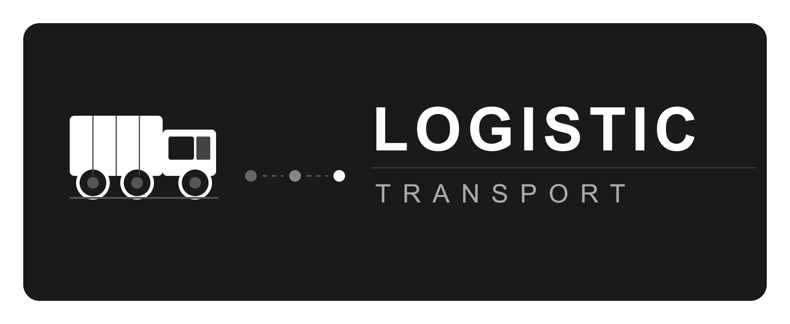
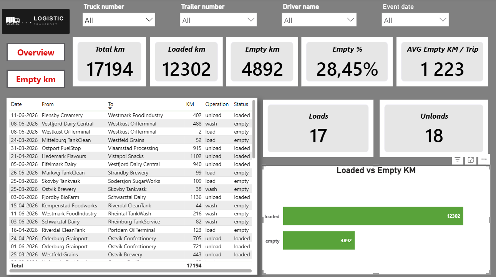
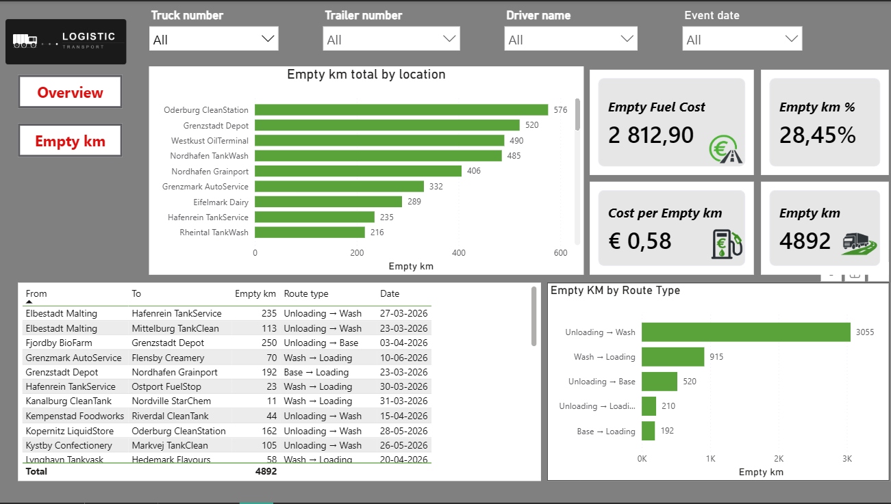

# Tank Transport Analytics — Power BI & PostgreSQL

<p align="center">
  
</p>

An end-to-end Business Intelligence project for tank transport operations, focused on analyzing loaded and empty movements, loading and unloading activity, tank cleaning operations, fleet utilization, and transport efficiency.

The project combines **PostgreSQL** for data modeling and analytical logic with **Power BI** for interactive reporting and operational analysis.

> **Demo Project — Synthetic Data**
>
> All operational data used in this repository is synthetic and created specifically for demonstration purposes. Company names, drivers, vehicles, locations, routes, dates, and transport events do not represent real operational records.

---

## Dashboard Preview





---

## Project Structure

```text
├── SQL/
│   ├── DDL_schema.sql
│   ├── drivers.sql
│   ├── addtrucks.sql
│   ├── addtrailers.sql
│   ├── trip2026_03_22-2026_04_03.sql
│   ├── trip2026_04_12-2026_04_24.sql
│   ├── trip2026_05_25-2026_06_12.sql
│   ├── vw_trip_analysis_logistic.sql
│   ├── vw_trip_analysis_logistic3.sql
│   └── DML_queries.sql
│
├── screenshots/
│
├── powerbi/
│   └── Tank_Transport_Analytics.pbix
│
└── README.md
```

---

## Business Scenario

Tank transport operations consist of multiple connected events such as:

```text
Base → Loading → Unloading → Tank Wash → Loading → Unloading
```

Between these events, a truck can travel either loaded or empty.

The analytical model transforms individual operational events into transport movements and allows users to analyze:

* Total, loaded, and empty distance
* Empty KM percentage
* Loading and unloading activity
* Empty movements between operational events
* Tank wash movements
* Truck, trailer, and driver activity
* Route patterns
* Operational cycles
* Estimated cost of empty kilometres

The goal is to provide a management-level view of transport activity while preserving the ability to drill down into individual movements.

---

## Database Model

### Core Tables

* **drivers** — driver registry
* **trucks** — truck registry
* **trailers** — trailer registry
* **trips** — transport trip records
* **trip_events** — chronological operational event log
* **truck_driver_assignments** — driver/truck assignment history
* **truck_trailer_assignments** — truck/trailer assignment history

Operational events include:

* Start
* Load
* Unload
* Wash
* Finish

---

## Analytical Layer

The project uses PostgreSQL analytical views to transform raw transport events into BI-ready datasets.

### `vw_trip_analysis_logistic`

Provides the main movement-level analytical dataset, including:

* Event sequencing
* Previous and next operational events
* Distance between events
* Loaded vs Empty movement classification
* Operational route types
* Stop duration calculations
* Loading, unloading, and wash sequences

### `vw_trip_analysis_logistic3`

Extends the analytical model with additional event and movement context used by the Power BI dashboard.

The views use SQL window functions such as:

* `LAG()`
* `LEAD()`
* Partitioning by truck and trip
* Chronological event sequencing

Example calculated fields include:

```text
km_from_previous_event
km_to_next_event
movement_type
route_type
full_operational_cycle
```

---

## Key Metrics

| Metric | Description |
| --- | --- |
| Total KM | Total distance travelled |
| Loaded KM | Distance travelled with cargo |
| Empty KM | Distance travelled without cargo |
| Empty % | Share of total distance driven empty |
| AVG Empty KM / Trip | Average empty distance per transport trip |
| Loads | Number of loading operations |
| Unloads | Number of unloading operations |
| Empty Fuel Cost | Estimated fuel cost generated by empty movements |
| Cost per Empty KM | Estimated operating cost per empty kilometre |

---

## Power BI Dashboard

### Page 1 — Overview

The main operational overview provides:

* Total KM
* Loaded KM
* Empty KM
* Empty KM %
* Average Empty KM per Trip
* Number of Loads
* Number of Unloads
* Loaded vs Empty KM comparison
* Detailed movement table

Interactive filters allow analysis by:

* Truck
* Trailer
* Driver
* Event date

### Page 2 — Empty KM Analysis

Dedicated analysis of empty transport movements:

* Empty KM by location
* Empty KM by route type
* Unloading → Wash movements
* Wash → Loading movements
* Unloading → Base movements
* Base → Wash movements
* Base → Loading movements
* Detailed empty movement table
* Estimated Empty Fuel Cost
* Empty KM %
* Cost per Empty KM

This page allows users to identify where empty kilometres occur and explore the operational context behind individual empty movements.

---

## Synthetic Dataset

The repository contains a fully synthetic operational dataset designed to simulate realistic European tank transport activity.

It includes multiple:

* Drivers
* Trucks
* Trailers
* Trips
* Customers
* Tank wash locations
* Loading locations
* Unloading locations
* Empty and loaded movements

Distances, dates, vehicle identifiers, company names, and locations are fictional or modified for demonstration purposes.

The dataset is designed to preserve realistic transport logic without exposing real company operational data.

---

## How to Run

### 1. Create the PostgreSQL Schema

```sql
CREATE SCHEMA logistic;
```

### 2. Execute the SQL Files

Run the database and seed scripts required to create the tables and populate the synthetic dataset.

Then create the analytical views:

```text
vw_trip_analysis_logistic.sql
vw_trip_analysis_logistic3.sql
```

### 3. Open Power BI

Open:

```text
powerbi/Tank_Transport_Analytics.pbix
```

Configure the PostgreSQL connection:

```text
Host: localhost
Database: postgres
Schema: logistic
```

Refresh the dataset in Power BI.

---

## Tech Stack

* PostgreSQL
* SQL
* SQL Window Functions
* Relational Data Modeling
* DBeaver
* Power BI Desktop
* DAX
* Power Query
* Business Intelligence
* Logistics Data Analytics

---

## Current Development

The project is actively evolving.

Planned development includes:

* Additional transport KPIs
* Truck and trailer utilization analysis
* Tank wash analytics
* Route and operational cycle analysis
* Cost analysis
* Time-based trends
* Additional synthetic transport scenarios
* Extended Power BI reporting

The architecture is designed so that additional operational data and business metrics can be incorporated into the analytical model.

---

## Project Purpose

This project demonstrates the complete analytics workflow:

```text
Operational Data
      ↓
PostgreSQL
      ↓
SQL Data Model
      ↓
Analytical Views
      ↓
Power BI
      ↓
Business Intelligence Dashboard
```

It combines technical data analytics skills with transport-domain business logic to transform operational transport events into management-level information.

---

## Author

Portfolio project developed to demonstrate practical skills in:

* SQL Data Modeling
* PostgreSQL
* Power BI
* DAX
* Business Intelligence
* Data Visualization
* Logistics and Transport Analytics


---

## Author

Built as a portfolio project demonstrating SQL data modeling and BI reporting for logistics operations.
